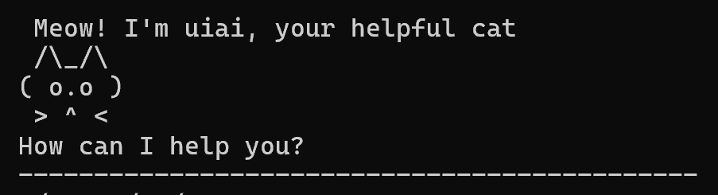
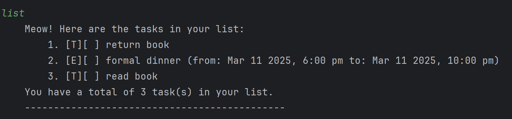
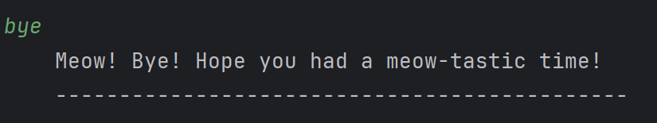
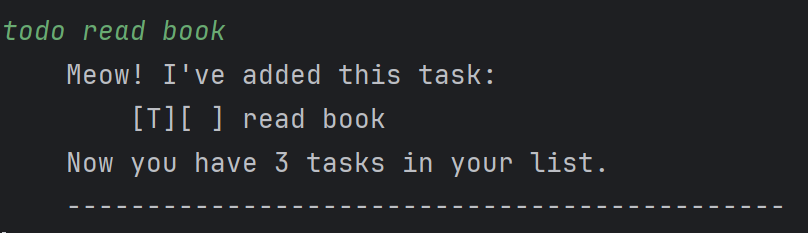
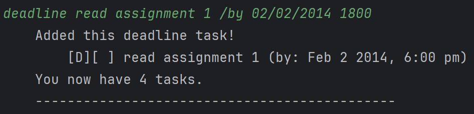
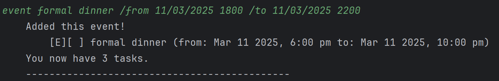
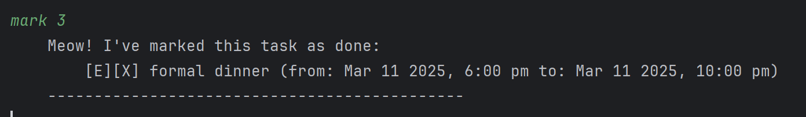
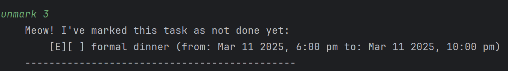
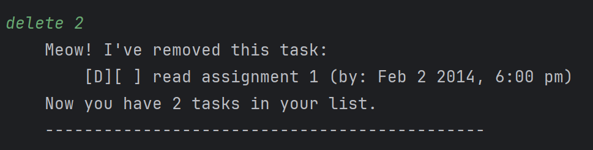
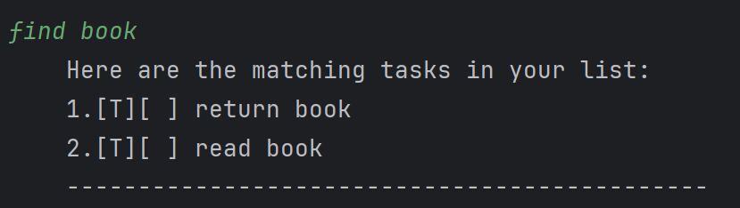

# Uiai User Guide

Uiai is a desktop cat helper app for organizing tasks, optimized for use via a Command Line Interface (CLI) while still having the benefits of a Graphical User Interface (GUI).

## Quick Start

1. Ensure you have Java 17 or above installed in your Computer.
2. Download the latest uiai.jar file.
3. Copy the file to the folder you want to use as the home folder for your Uiai helper.
4. Open a command terminal, cd into the folder you put the jar file in, and use the java -jar uiai.jar command to run the application.
   A GUI similar to above should appear in a few seconds.
5. Type the command in the command box and press Enter to execute it.
6. Refer to the Features below for details of each command.

## Features
> **Notes about the command format:**
> - Words in `UPPER_CASE` are parameters to be supplied by the user.\
> e.g. `todo TASK`, `TASK` is a parameter which can be used as `todo return book`.
> - Items in square brackets are formats that should be followed.\
>  e.g. `[dd/MM/yyyy HHmm]` should be input as `01/02/2024 1800`.
> - Parameters must be in exact order.

## List tasks added: `list`
Lists all the tasks added by the user.

Format: `list`

Expected output:\

## End Uiai session: `bye`
End the session with Uiai and save the current tasks.

Format: `bye`

Expected output:\

## Add Todo task: `todo`
Adds a Todo task with [T] to the list of tasks.

Format: `todo TASK`

Examples:
- `todo read book`
- `todo return keys`

Expected output:\

## Add Deadline task: `deadline`
Adds a Deadline task with [D] to the list of tasks.
- `BY` must be in the format [dd/MM/yyyy HHmm].

Format: `deadline TASK /by BY`

Examples:
- `deadline read assignment 1 /by 02/02/2014 1800`
- `deadline complete homework 1 /by 05/12/2004 1900`

Expected output:\

## Add Event task: `event`
Adds a Event task with [E] to the list of tasks.
- `FROM` and  `TO` must be in the format [dd/MM/yyyy HHmm].

Format: `event TASK /from FROM /to TO`

Examples: 
- `event formal dinner /from 11/03/2025 1800 /to 11/03/2025 2200`
- `event carnival /from 12/01/2024 1800 /to 12/01/2024 2000`

Expected output:\

## Mark a task in the list: `mark`
Marks a task in the list with X.
- `INDEX` must be a number from 1 to the total number of current tasks.

Format: `mark INDEX`

Examples: 
- `mark 3`

Expected output:\

## Unmark a task in the list: `unmark`
Unmarks a task in the list, removing the X.
- `INDEX` must be a number of a task from the list that is currently marked.

Format: `unmark INDEX`

Examples: 
- `unmark 3`

Expected output:\

## Delete a task in the list: `delete`
Deletes a task in the list specified by the `INDEX`.
- `INDEX` must be a number from 1 to the total number of current tasks.

Format: `delete INDEX`

Examples: 
- `delete 2`

Expected output:\

## Find tasks in the list that matches input: `find`
Finds tasks in the list that matches the `INPUT` and lists them.

Format: `find INPUT`

Examples: 
- `find book`

Expected output:\

